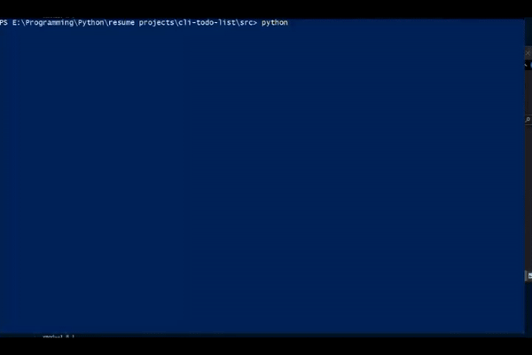

# CLI Task Manager

A lightweight, terminal-based task manager to keep you organized and productive!

## Features

- Add, edit, and delete tasks
- Task are organized by date

## Installation

Clone the repository and install dependencies:

````bash
git clone https://github.com/dj-idk/cli-todo.git
cd cli-todo-list
pip install -r requirements.txt


## Usage

Run the application:
```bash
python src/main.py
````

#### Contributing

```markdown
## Contributing

Contributions are welcome! Please open an issue or submit a pull request for bug fixes or features.
```

## Demo


